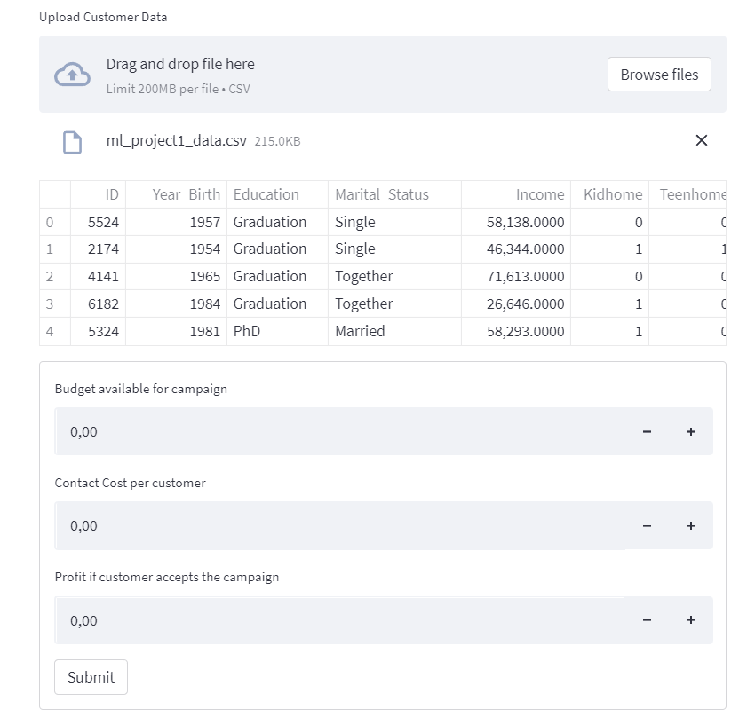
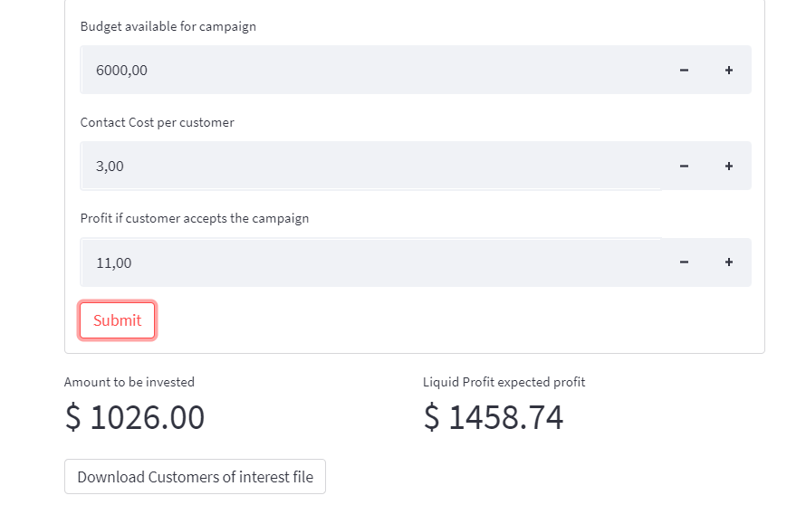

# How to use the App

The uploaded file *MUST* contain the following columns:

* Income
* NumCatalogPurchases
* NumWebPurchases
* MntFruits
* NumStorePurchases
* MntMeatProducts
* MntSweetProducts
* MntWines
* MntFishProducts
* YearOfEnrollment
* Year_Birth
* MntGoldProds
* Recency

After Uploading the file, a window with input boxes will appear:

After setting the input parameter, the app will return the optimal amount to be invested and the expected profit and a download button so you can download a database with the IDs and the probability of campaign acceptance of the best customers, which were selected.

