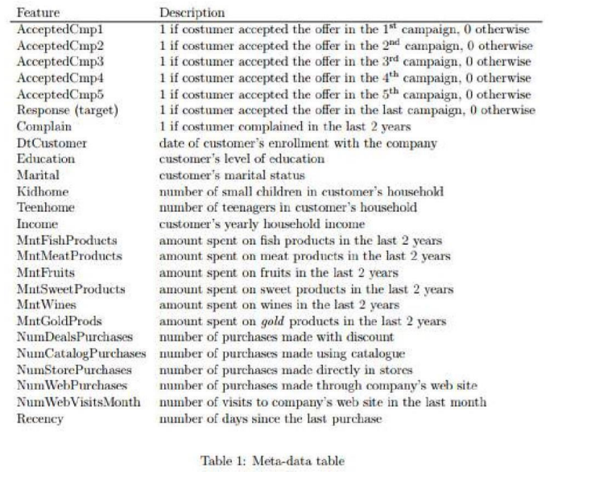

# CRM Data Analysis

A company is the lead food delivery app in Brazil, present in over a thousand cities.

Keeping a high customer engagement is key for growing and consolidating the company’s
position as the market leader.

Data Analysts working within the data team are constantly challenged to provide insights and
value to the company through open scope projects.

In this project, given presented a sample dataset, that mocks metainformation on the customer
and on the comapany campaign interactions with that customer

the objective of this project is to understand the data, find business opportunities, insights and to propose
any data driven action to optimize the campaigns results & generate value to the company.

## The Company

Considering a well-established company operating in the retail food sector. Presently they have around
several hundred thousand registered customers and serve almost one million consumers a year.
They sell products from 5 major categories: wines, rare meat products, exotic fruits, specially
prepared fish and sweet products. These can further be divided into gold and regular products. The
customers can order and acquire products through 3 sales channels: physical stores, catalogs and
company’s website. Globally, the company had solid revenues and a healthy bottom line in the past
3 years, but the profit growth perspectives for the next 3 years are not promising... For this reason,
several strategic initiatives are being considered to invert this situation. One is to improve the
performance of marketing activities, with a special focus on marketing campaigns.

## The marketing department

The marketing department was pressured to spend its annual budget more wisely. The CMO
perceives the importance of having a more quantitative approach when taking decisions, reason why
a small team of data scientists was hired with a clear objective in mind: to build a predictive model
which will support direct marketing initiatives. Desirably, the success of these activities will prove the
value of the approach and convince the more skeptical within the company.

## The data

The data set contains socio-demographic and firmographic features about 2.240 customers who
were contacted. Additionally, it contains a flag for those customers who responded the campaign,
by buying the product.

## The objective

The objective of this project is to build a predictive model that will produce the highest profit for the next direct marketing campaign, scheduled for the next month. The new campaign, sixth, aims at selling a new gadget to the Customer Database. To build the model, a pilot campaign involving 2.240 customers was carried out. The customers were selected at random and contacted by phone regarding the acquisition of the gadget. During the following months, customers who bought the offer were properly labeled. The total cost of the sample campaign was 6.720MU and the revenue generated by the customers who accepted the offer was 3.674MU. Globally the campaign had a profit of -3.046MU. The success rate of the campaign was 15%. The objective is of the team is to develop a model that predicts customer behavior and to apply it to the rest of the customer base. Hopefully, the model will allow the company to cherry pick the customers that are most likely to purchase the offer while leaving out the non-respondents, making the next campaign highly profitable. Moreover, other than maximizing the profit of the campaign, the CMO is interested in understanding to study the characteristic features of those customers who are willing to buy the gadget.
